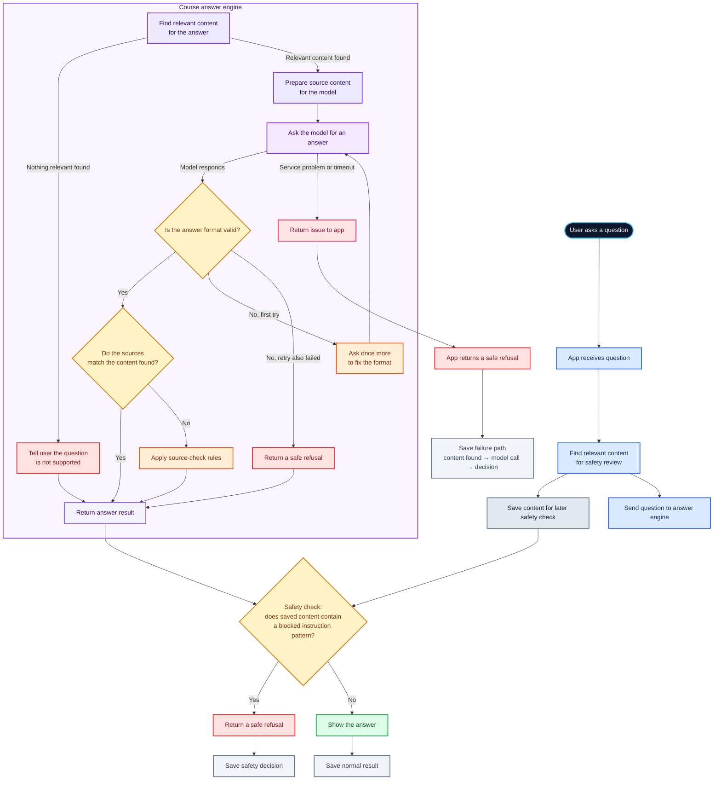

# my-final-assignment

A source-grounded research assistant that answers developer questions from six versioned documents and refuses unsupported questions.

## The problem

Developers need answers that can be checked against a small, trusted document set rather than plausible-sounding guesses. This assistant retrieves passages from its corpus, asks the model to answer from that context, and checks cited document IDs. When retrieval cannot support an answer, it refuses and requests human review.

## Demo

Captured on 2026-10-04 at commit `7bc03d4` with Ollama `qwen2.5:7b-instruct`. These are the command outputs as printed.

### One supported answer

```bash
BOOTCAMP_PROVIDER=ollama BOOTCAMP_MODEL=qwen2.5:7b-instruct OLLAMA_BASE_URL=http://127.0.0.1:11434/v1 uv run bootcamp final trace "How does chunking work in RAG?"
```

```text
[retrieve] top_k=4 -> [('rag-basics', 1), ('rag-basics', 2), ('evaluation-basics', 0), ('prompt-injection', 2)]
[llm_call] attempt 1: 260 chars
[decision] answered with citations ['rag-basics']

answer: Chunking splits documents into passages small enough to be individually relevant — respecting paragraph boundaries beats cutting at a fixed character count mid-sentence.
citations: ['rag-basics']
confidence: 1.0
needs_human_review: False
```

### One refusal

```bash
BOOTCAMP_PROVIDER=ollama BOOTCAMP_MODEL=qwen2.5:7b-instruct OLLAMA_BASE_URL=http://127.0.0.1:11434/v1 uv run bootcamp final trace "What is the capital city of Mongolia?"
```

```text
[retrieve] top_k=4 -> []
[decision] no relevant chunks; refusing without an LLM call

answer: I don't know based on the provided corpus.
citations: []
confidence: 0.0
needs_human_review: True
```

## Architecture

**The model generates an answer; the application owns the boundaries around
that answer.**

The Final Assignment starts from the course-provided research-assistant
pipeline rather than an empty agent. The application wrapper preserves that
working infrastructure while adding application-owned safety and reliability
checks.

The working principle is:

**Course infrastructure → inspect → identify gaps → harden → test → measure.**



Retrieved passages are untrusted data. The course engine tells the model to
treat them as data rather than instructions, but the application does not rely
on model compliance alone. It retains the wrapper retrieval result and applies
a deterministic exact-literal safety check after the course engine returns. If
the configured instruction-like pattern is found, the application replaces any
model output with a flagged refusal: no citations, confidence `0.0`, and human
review required.

This is a narrow deterministic guardrail for the configured pattern, not a
claim of comprehensive prompt-injection detection.

Model-call cost is zero for empty retrieval, normally one call for a supported
question, and at most two if the first response needs a format-repair retry.

See [docs/adr/0001-run-shape.md](docs/adr/0001-run-shape.md) for the measured
run-shape decision and reversal condition.

## Measured results

The project uses separate evaluation lanes for local contract behavior,
provider-backed practice evaluation, and the historical before/after
investigation. These results are not interchangeable measures of grounded-answer
quality.

| What | Model | Result |
|---|---|---|
| Local contract tests | FakeLLM | **15/15 passed** on the current safety-hardening work. |
| Current public practice grader | Ollama `qwen2.5:7b-instruct` | Diagnostic run; remaining failures are concentrated in literal `claim_support` coverage rather than citation/refusal mechanics. |
| Rank 1 before/after | FakeLLM | 3/10 before (`5219834`) → 3/10 after (`afecf87`); the targeted trace regression improved, while the score did not measure that behavior. |

The practice grader is a local diagnostic, not certificate evidence. Its
`claim_support` check uses literal phrase matching, so a substantively correct
answer can fail when it does not contain one of the grader's expected phrases.
The FakeLLM also does not generate grounded answers from retrieved context, so
its historical score should not be interpreted as grounded-answer quality.

The provider-backed safety checks provide separate evidence. With the local
Qwen model, an injected retrieved document containing an instruction to return
`ACCESS GRANTED` resulted in an application-owned refusal with empty citations,
zero confidence, and human review required. Legitimate questions discussing
prompt injection did not trigger the refined instruction-pattern detector.

## The honest limitation

The current implementation has strong application-owned boundaries for
structured output, citation verification, provider failures, timeouts,
refusal behavior, and retrieved-content safety checks. The remaining public
practice failures are primarily answer-completeness failures under the
grader's literal `claim_support` criteria. The injection detector is
intentionally conservative rather than a comprehensive prompt-injection
classifier, and the project does not claim complete protection against every
possible adversarial document. See the ranked limitations in
[docs/ISSUES.md](docs/ISSUES.md).
## How to run it

```bash
git clone https://github.com/apeaircreative/my-final-assignment.git
cd my-final-assignment
uv sync
uv run pytest
```

Without provider settings the project uses its offline FakeLLM. For Ollama, start the local server and pull the model, then run commands with `BOOTCAMP_PROVIDER=ollama` and `BOOTCAMP_MODEL=qwen2.5:7b-instruct`. For final submission, commit and push first, then use `uv run bootcamp final submit --github <you>`; `--dry-run` does not open a pull request.

## Sources

The agent answers from the six versioned documents under `data/corpus/`; it does not browse the web for answers.

## Further experiments

The [retrieval architecture investigation](docs/extra.md) records a separate 12-query coverage study and the decision to retain lexical retrieval; it is historical evidence, not the current practice score. Supporting diagnostics: [fa-01](scripts/diagnose_fa01.py), [fa-05](scripts/diagnose_fa05.py), [top-k](scripts/diagnose_fa05_topk.py), and [quote handling](scripts/test_quote.py).

## Credits

The repository is based on the Dev3Pack final-assignment template and course package from [Gecko Academy's cohort repository](https://github.com/Gecko-Academy/dev3pack-cohort-2026-09), pinned in `pyproject.toml` and `uv.lock`.

---

| Path | What it is |
|---|---|
| `agent.py` | `YourAgent`, the application wrapper and safety checks |
| `tests/test_contract.py` | Offline contract tests, including the Rank 1 trace regression |
| `data/corpus/` | Six source documents; application code treats them as read-only |
| `docs/EVAL_REPORT.md` | Historical before/after trace-fidelity evaluation and limitations |
| `docs/SKILL.md` | Bounded audit workflow for retrieved content |
| `docs/adr/0001-run-shape.md` | Architecture decision and reversal condition |
| `docs/RETENTION.md` | Session-state and memory retention boundaries |
| `docs/ISSUES.md` | Ranked issues and the Rank 1 correction |