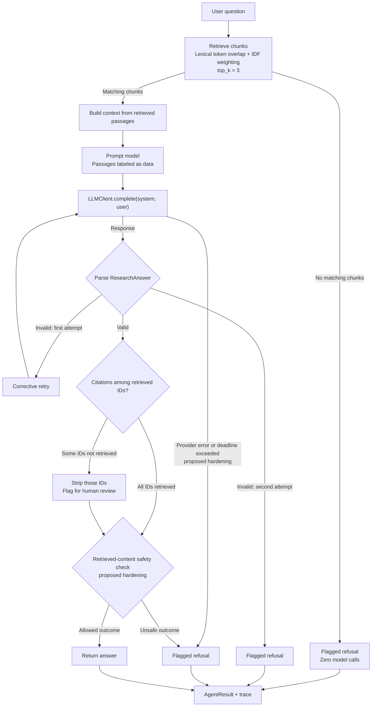

# Final Assignment Architecture Boundary

## The starting point

The Final Assignment does not start from an empty agent. The course package already provides the core research-assistant pipeline. The student’s task is to inspect that baseline, identify gaps in its reliability contract, and harden those boundaries without rebuilding working infrastructure.

**Working principle:** Course infrastructure → inspect → identify gaps → harden → test → measure.

## Architecture



The provider-error, deadline, and retrieved-content safety branches are **proposed hardening**, not behavior the starter already implements. “Matching chunks” means retrieval found token overlap; it does not prove that the passage answers the question.

## What already exists

Inspection of the installed course package showed that `answer_question()` already provides:

- Deterministic lexical retrieval, returning up to three scored chunks.
- A refusal without a model call when retrieval returns no chunks.
- Context construction and a prompt that labels retrieved passages as data.
- Parsing into a structured `ResearchAnswer`, with one corrective retry after a parse failure.
- A flagged refusal if parsing fails twice.
- Verification of citation IDs against retrieved IDs; fabricated IDs are stripped and the answer is flagged.
- An `AgentResult` containing the answer and execution trace.

The retrieval function scores query-token overlap with inverse-document-frequency weighting. It is a deliberately inspectable lexical baseline, not embedding-based semantic search. No measured retrieval failure has yet established a need to replace it.

## Where hardening belongs

The provider interface is deliberately small:

```python
complete(system: str, user: str) -> str
```

The provider handles model communication. `YourAgent` should own the application-level decisions around that call:

| Boundary | Current gap | Contract target |
|---|---|---|
| Retrieved data → final answer | The prompt says passages are data, but an obedient model can still follow an embedded instruction and cite a retrieved document. | Prevent that outcome from being returned unflagged. |
| Provider failure → refusal | A provider exception can escape `answer_question()`. | Return a flagged refusal instead of raising to the caller. |
| Provider execution → deadline | `YourAgent.timeout_s` exists but is not enforced; `complete()` has no timeout parameter. | Return a flagged refusal within the application deadline when a provider hangs. |

The injection test deliberately lets the malicious text reach the model. Its requirement is not “never show the model adversarial text”; it is “never return the injected answer as an unflagged application outcome.”

## Evidence and status

This boundary is based on the `agent.py`, `tests/test_contract.py`, and corpus contents you shared, plus your inspection output for `answer_question()`, `retrieve()`, `LLMClient`, its adapters, and `ResearchAnswer`. The three hardening targets correspond to the three current `xfail` contract tests.

This is a **pre-implementation design**, not a claim that the safeguards work. The proof still needs to come from implementing one change at a time, running its focused test, running the full suite, and measuring the result.